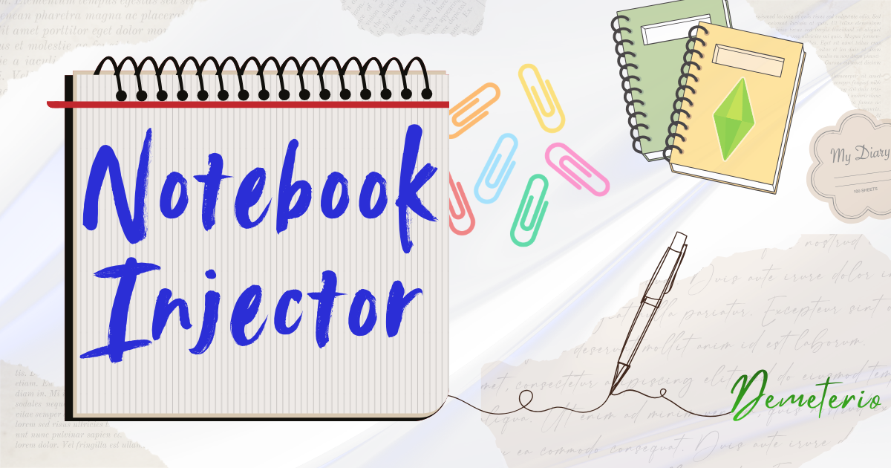
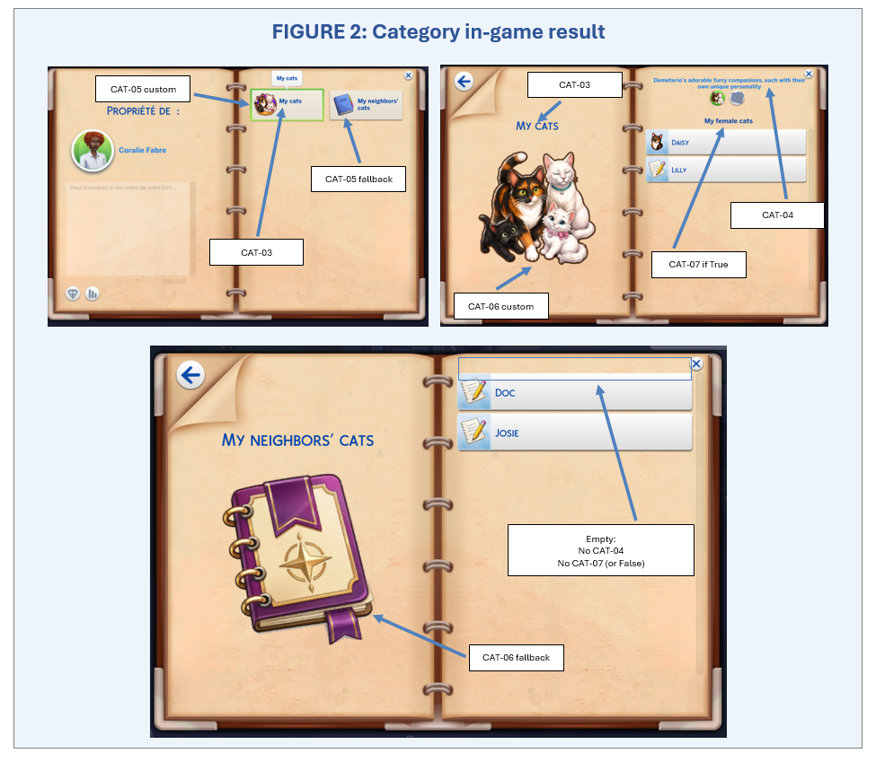
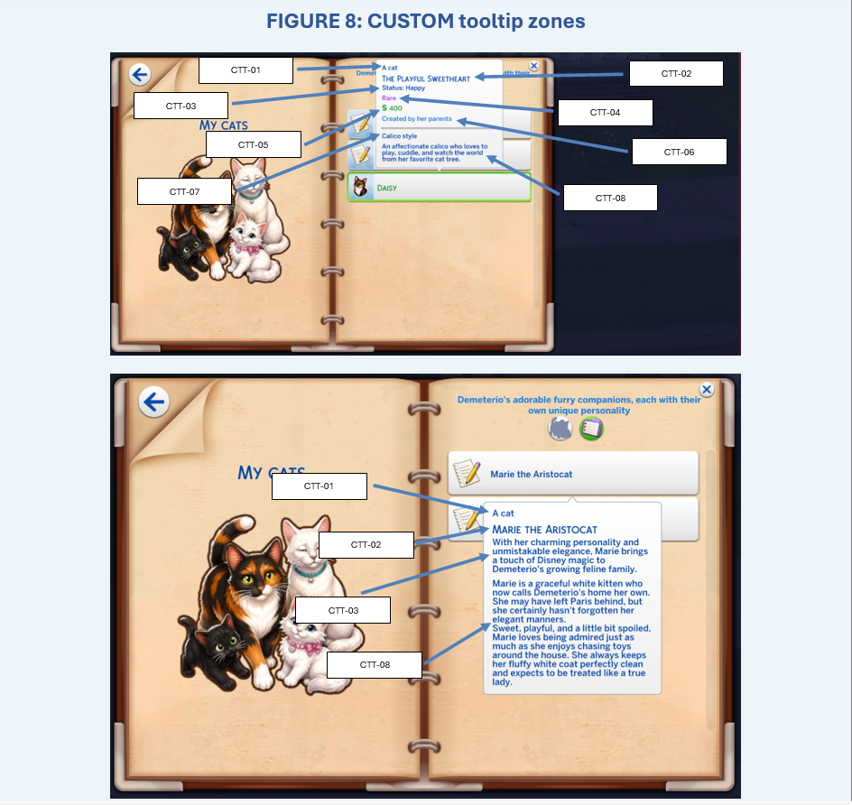
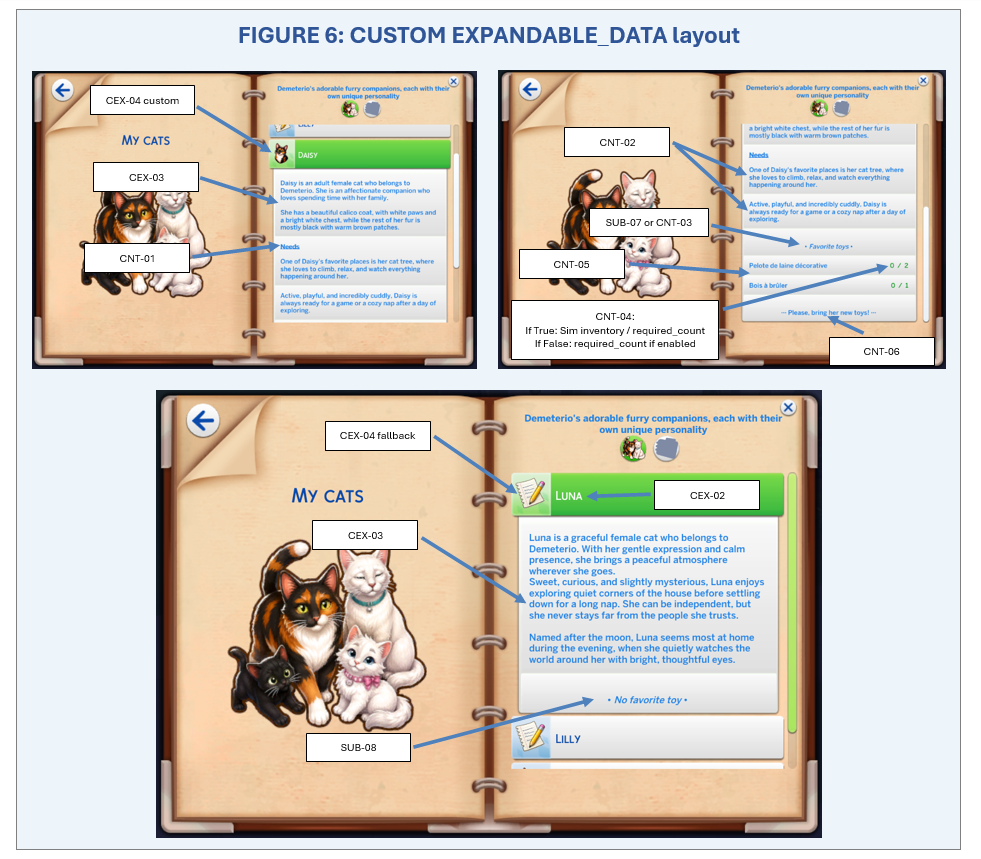

# Demeterio's Notebook Injector

**Notebook Injector**, or **NI**, is a tuning and script framework that allows compatible mods to add new content to the in-game Notebook in **The Sims 4**.

NI can register custom categories and subcategories, place notebook entries inside them, and support several types of notebook content without requiring traditional XML overrides of EA notebook resources.

Notebook Injector does not add gameplay content by itself. It must be used by a compatible mod that includes its own NI declaration package.

## Official links

| Resource                | Link                                                                                            |
| ----------------------- | ----------------------------------------------------------------------------------------------- |
| Latest official release | [Download from GitHub Releases](https://github.com/Demeterio/Notebook-Injector/releases/latest) |
| Mod The Sims profile    | [Demeterio on Mod The Sims](https://modthesims.info/m/10304233)                                 |
| Creator blog            | [Demeterio on Tumblr](https://demeterio.tumblr.com/)                                            |
| Discord community       | [Demeterio's Discord](https://discord.gg/mPyRPScgeS)                                            |
| Public Python source    | [`src/`](src/)                                                                                  |

> [!IMPORTANT]
> Download the mod from an official release link.
>
> GitHub's automatically generated **Source code** ZIP and TAR archives are not ready-to-install Sims 4 mod files.

## Screenshots

<p align="center">
  
  
</p>

<p align="center">
  
</p>


## What Notebook Injector does

Notebook Injector can:

* add custom notebook categories and subcategories;
* add content to compatible existing notebook categories;
* assign notebook entries to custom or existing subcategories;
* allocate unused category and subcategory enum values;
* detect known enum-name and enum-value conflicts;
* support standard and specialized notebook entries;
* display a version warning when a compatible mod requires a newer NI Core ABI;
* write technical diagnostics to a rotating local log.

NI also includes a **CUSTOM entry type** that lets mod creators build notebook entries using several configurable content options, together with a fully customizable tooltip. See the screenshots above for examples.

Supported NI entry kinds include:

* default notebook entries;
* bait;
* recipes;
* animal feed;
* country items;
* gardening plants;
* custom text and ingredient layouts.

NI performs controlled runtime injections after the relevant game tunings have loaded. Existing EA notebook categories are preserved when NI merges compatible content into the notebook mapping.

## Downloads

Every official release provides two archive types.

### PLAYER ZIP

Use the **PLAYER ZIP** for a normal game installation.

### MODDER ZIP

Use the **MODDER ZIP** when creating a Notebook Injector integration for another mod.

## Installation

See Installation.txt in the ZIP.

## Compatibility

See the compatibility file included with each release for the current tested information and mods.

## For mod creators

[Documentation is here! Click me!](docs/Demeterio_NotebookInjector_Modder_Guide.pdf)

A compatible mod provides tuning resources that declare its notebook content through NI.

A creator can:

* create a custom category;
* add a custom subcategory to a custom or existing category;
* assign entries to a custom or existing subcategory;
* configure icons, names, descriptions, tooltips, sorting, and entry limits;
* use supported EA notebook formats;
* use specialized NI entry kinds;
* declare the minimum NI Core ABI required by the integration.

Use the latest **MODDER ZIP** and follow its PDF guide. The guide and template packages are versioned with the corresponding NI release.

Players must install the current Notebook Injector core separately. Do not bundle or redistribute the Core with another mod.

## Commands

Open the cheat console with `Ctrl` + `Shift` + `C`.

| Command                                               | Purpose                                                                                                            |
| ----------------------------------------------------- | ------------------------------------------------------------------------------------------------------------------ |
| `demeterio.ni_version`                                | Shows the installed NI release and Core ABI versions and writes the registered compatible-mod versions to the log. |
| `demeterio.ni_getlist`                                | Writes the registered NI categories and subcategories to the log.                                                  |
| `demeterio.ni_getenums`                               | Checks notebook enums for conflicts and writes detailed diagnostics to the log.                                    |
| `demeterio.ni_loot <loot ID>`                         | Applies the specified loot action to the active Sim.                                                               |
| `demeterio.ni_clearcat <category key or value>`       | Removes unlocked notebook entries from the specified category for the active Sim.                                  |
| `demeterio.ni_clearsubcat <subcategory key or value>` | Removes unlocked notebook entries from the specified subcategory for the active Sim.                               |

These commands do not require `testingcheats on`.

> [!CAUTION]
> The loot and clear commands modify the active Sim's data. Use them on a disposable test save when troubleshooting.

## Logs and diagnostics

Notebook Injector creates its technical log beside the installed `.ts4script`:

```text
demeterio_notebookinjector_log.txt
```

Older entries may be moved automatically to:

```text
demeterio_notebookinjector_log.1.txt
```

Use the following command when checking category, subcategory, or enum conflicts:

```text
demeterio.ni_getenums
```

The standard log records commands, warnings, errors, and basic startup information. An optional Debuglog package is available for more detailed development diagnostics.

## Public source code and release policy

This repository contains the public Python source used by Notebook Injector.

For each published version:

1. [`src/`](src/) is updated to match the release;
2. the `.ts4script` and `.package` files are built and tested;
3. the PLAYER and MODDER ZIP archives are attached to a GitHub Release;
4. the release receives a versioned tag;
5. corrections are published as a new release instead of silently replacing an old one.

The public source is provided for transparency, reference, and development purposes.

Do not install files directly from `src/`. Use the ready-to-install assets from the [latest official release](https://github.com/Demeterio/Notebook-Injector/releases/latest).

Source visibility does not grant permission to redistribute, repackage, mirror, or publish modified versions.

## Development targets

Notebook Injector targets:

* The Sims 4;
* the game's Python 3.7 runtime;
* Python 3.7-compatible syntax;
* Sims 4 Studio.

## Support and bug reports

Before reporting a problem, collect:

* The Sims 4 game version;
* Notebook Injector version;
* the affected mod's name and version;
* clear reproduction steps;
* `demeterio_notebookinjector_log.txt`;
* `demeterio_notebookinjector_log.1.txt`, when present;
* `lastException.txt` or `lastUIException.txt`, when present;
* whether the issue also occurs on a disposable test save.

Use the official Mod The Sims page or the [Issues](https://github.com/Demeterio/Notebook-Injector/issues/new/choose) page for support.

Do not publicly post passwords, access tokens, private keys, personal information, private repository addresses, or unrelated private logs.

## Disclaimer

Notebook Injector is an unofficial fan-made project.

It is not affiliated with, authorized by, sponsored by, or endorsed by Electronic Arts, Maxis, GitHub, Mod The Sims, SimFileShare, or any other third-party creator.

The Sims 4 and all related names, game code, assets, logos, and trademarks belong to their respective owners.

## Copyright and permissions

Copyright © 2022–2026 Demeterio. All rights reserved.

The Notebook Injector source code, documentation, original tuning examples, branding, and original assets may not be copied, redistributed, repackaged, mirrored, sold, or published in modified form without explicit permission, except where a separate license states otherwise.

Third-party creators retain ownership of their own mods, integration packages, text, code, translations, images, and other original work.
